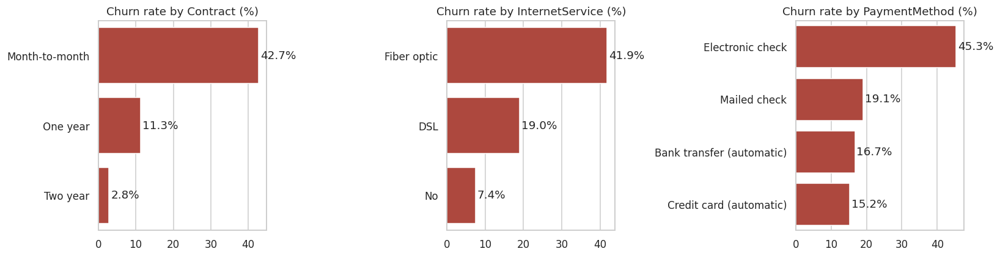
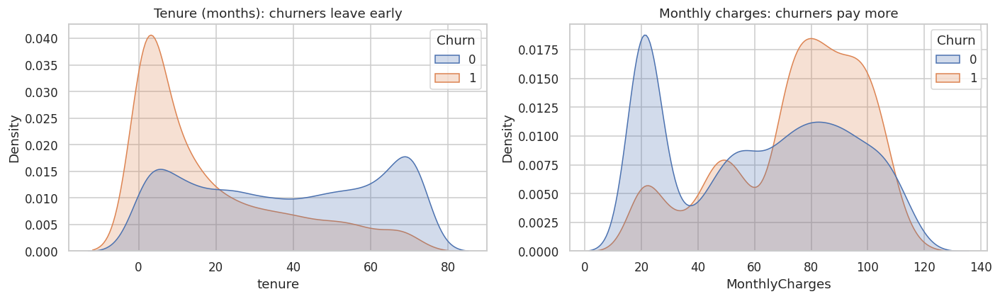
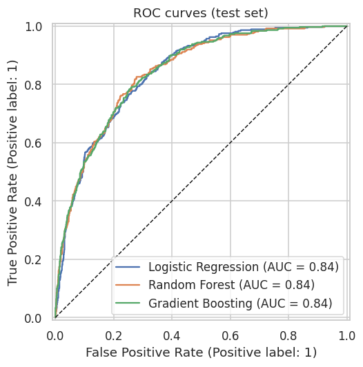
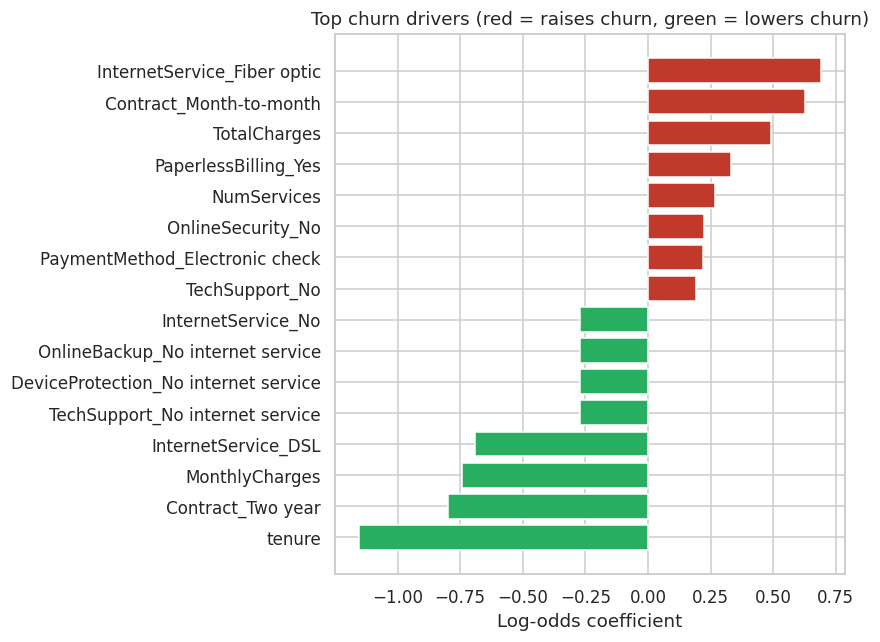

# 📉 Telecom Customer Churn Prediction (Machine Learning)

  

**Business problem:** a telecom company loses **26.5%** of its customers. I built a machine-learning model that predicts **which customers are likely to churn**, explains **why**, and sorts customers into **risk tiers** so the retention team can focus where it matters.

## 📊 Dataset
[IBM Telco Customer Churn](https://github.com/IBM/telco-customer-churn-on-icp4d): **7,043 customers × 21 features** (demographics, subscribed services, contract, billing, churn label).

## 🛠️ Approach
1. **Cleaning:** converted `TotalCharges` from text to numbers. 11 blanks belonged to brand-new customers (tenure 0), so they were set to 0.
2. **EDA:** churn rate by contract, internet service, payment method, tenure and charges.
3. **Feature engineering:** `NumServices` (count of add-ons) and `AvgMonthlySpend`.
4. **Pipeline:** `ColumnTransformer` (StandardScaler + OneHotEncoder) plus the model, so the same steps apply in training and prediction (no leakage).
5. **Models:** Logistic Regression, Random Forest and Gradient Boosting, with class balancing for the 26/74 imbalance.
6. **Evaluation:** 5-fold stratified cross-validation, then a held-out test set (20%). Metrics: ROC-AUC, recall, precision, F1.
7. **Explainability and business scoring:** coefficient-based churn drivers and Low/Medium/High risk tiers.

## 🏆 Results (test set, 1,409 customers)
| Model | CV ROC-AUC | Accuracy | Precision | Recall | F1 | Test ROC-AUC |
|---|---|---|---|---|---|---|
| Logistic Regression | 0.846 | 0.738 | 0.504 | **0.783** | 0.614 | 0.842 |
| Random Forest | 0.846 | 0.771 | 0.550 | 0.759 | **0.638** | 0.842 |
| Gradient Boosting | 0.846 | **0.803** | **0.669** | 0.508 | 0.578 | **0.843** |

All three models rank customers equally well (**ROC-AUC ≈ 0.84**). For a retention campaign, where **missing a churner costs more than an extra call**, the class-balanced **Random Forest** is the best trade-off: it catches **76% of churners** with the best F1, so it is the saved production model.

**Risk tiers:**
| Tier | Customers | Actual churn rate |
|---|---|---|
| 🔴 High | 410 | **57.8%** |
| 🟠 Medium | 320 | 28.7% |
| 🟢 Low | 679 | 6.6% |

➡️ The **top 20% highest-risk customers include 50% of all churners**, and the Low tier churns at only 6.6%.

## 📈 Visuals
| Churn by segment | Tenure & charges |
|---|---|
|  |  |
| **ROC curves** | **Churn drivers** |
|  |  |

## 💡 Insights & recommendations
| Finding | Recommendation |
|---|---|
| Month-to-month contracts churn at **42.7%**, against **11.3%** (1-year) and **2.8%** (2-year) | Discounts and perks for moving to annual plans |
| **47.4%** of customers in their first 12 months churn | Onboarding check-ins at months 1, 3 and 6 |
| Fiber optic users churn at **41.9%**, DSL at 19.0% | Review fiber service quality and pricing |
| Electronic-check payers churn at **45.3%**, auto-pay at ~16% | Nudge customers towards auto-pay with a small incentive |
| No tech support: **41.6%** churn; with support: 15.2% | Free Tech Support / Security for high-risk new customers |

## ▶️ How to run
```bash
pip install -r requirements.txt
jupyter notebook churn_prediction.ipynb
```
Use the saved model:
```python
import joblib, pandas as pd
model = joblib.load("models/churn_model.joblib")
# model.predict_proba(new_customers_df)[:, 1]  -> churn probability
```

## 📁 Structure
```
├── data/telco_customer_churn.csv
├── images/                  # charts
├── models/churn_model.joblib
├── churn_prediction.ipynb   # full analysis & modelling
├── requirements.txt
└── README.md
```

---
👤 **Ansh Rai**, Data Analyst · [LinkedIn](https://www.linkedin.com/in/anshrai-adr) · [GitHub](https://github.com/ANSHRAI21) · [Portfolio](https://a-s-pyratech-solutions.space)
